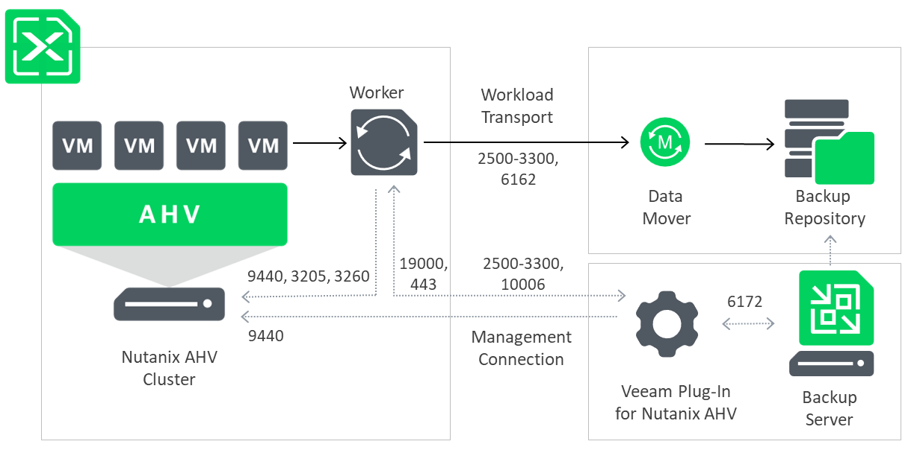

# Standalone Cluster Deployment Scenario

Since Veeam Plug-in for Nutanix AHV is integrated with Veeam Backup & Replication, the solution architecture in the standalone cluster deployment scenario comprises the following set of components:

* [Nutanix AHV cluster](#cluster)
* [Backup server](#server)
* [Veeam Plug-in for Nutanix AHV](#plugin)
* [Backup repositories](#repositories)
* [Workers](#workers)

Nutanix AHV Cluster

The Nutanix AHV cluster is a logical group of Nutanix HCI nodes managed by Nutanix Controller VMs (CVMs). While performing backup and restore operations, Veeam Plug-in for Nutanix AHV uses the Nutanix AHV cluster to access Nutanix AHV resources such as VMs, volume groups, storage containers and networks.

Backup Server

A backup server is either a Windows-based or Linux-based physical or virtual machine on which Veeam Backup & Replication is installed. The backup server is the configuration, administration and management core of the backup infrastructure. It coordinates backup and restore operations, controls job scheduling and manages resource allocation.

Veeam Plug-In for Nutanix AHV

Veeam Plug-in for Nutanix AHV is an architecture component that enables integration between the backup server and other components of the backup infrastructure. Veeam Plug-in for Nutanix AHV allows Veeam Backup & Replication to connect to the Nutanix AHV cluster and to manage backup and restore tasks to protect Nutanix AHV resources.

Backup Repositories

A backup repository is a storage location where Veeam Plug-in for Nutanix AHV stores backups of protected Nutanix AHV VMs.

To communicate with backup repositories, Veeam Plug-in for Nutanix AHV uses Veeam Data Mover — the service that is responsible for data processing and transfer. By default, Veeam Data Mover runs on the repositories themselves. If a repository cannot host Veeam Data Mover, it starts on a gateway server — a dedicated component that “bridges” the backup server and workers. For more information, see [Gateway Servers](gateway_server.md).

Workers

A worker is a Linux-based VM that resides in the Nutanix AHV cluster and processes backup workloads when transferring data to and from backup repositories.

