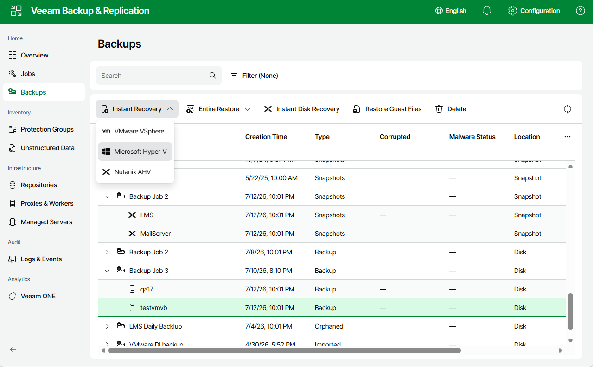

# Instant Recovery of Workloads to Hyper-V

To perform Instant Recovery to Microsoft Hyper-V environment, do the following:

1. Navigate to Backups.
2. In the working area, expand the necessary backup job, right-click the VM you want to restore and select Instant Recovery > Microsoft Hyper-V.

Alternatively, expand the necessary backup job, select the VM and click Instant Recovery > Microsoft Hyper-V on the menu.

1. Complete the Instant Recovery wizard as described in section [Performing Instant VM Recovery of Workloads to Hyper-V VMs](performing_instant_recovery_hv_vm_web.md).

Page updated 2026-07-13

