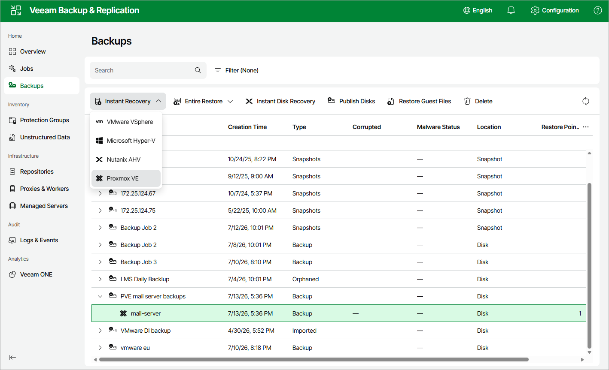

# Instant Recovery of Workloads to Proxmox VE

To perform Instant Recovery to Proxmox VE, do the following:

1. Navigate to Backups.
2. In the working area, expand the necessary backup job, right-click the VM you want to restore and select Instant Recovery > Proxmox VE.

Alternatively, expand the necessary backup job, select the VM and click Instant Recovery > Proxmox VE on the menu.

1. Complete the Instant Recovery wizard as described in section [Performing Instant VM Recovery of Workloads to Proxmox VE](pve_instant_recovery_pve.md).

Page updated 2026-07-15

