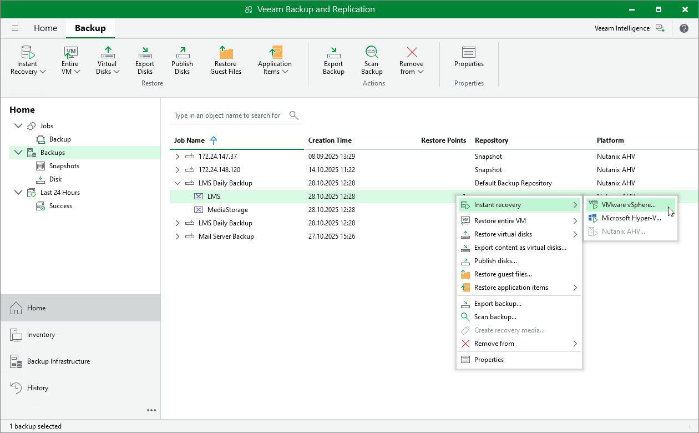

# Performing Instant Recovery of Workloads to VMware vSphere

To perform Instant Recovery to VMware vSphere environment, do the following:

1. In the Veeam Backup & Replication console, open the Home view.
2. In the inventory pane, select Backups.
3. In the working area, expand the necessary backup job, right-click the VM you want to restore and select Instant recovery.

Alternatively, expand the necessary backup job, select the VM and click Instant Recovery on the ribbon.

1. Complete the Instant Recovery wizard as described in section [Performing Instant VM Recovery of Workloads to VMware vSphere VMs](performing_instant_recovery_vm.md).

