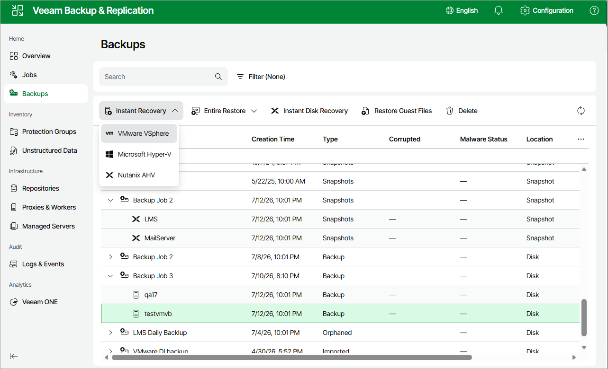

# Instant Recovery of Workloads to VMware vSphere

To perform Instant Recovery to VMware vSphere environment, do the following:

1. Navigate to Backups.
2. In the working area, expand the necessary backup job, right-click the VM you want to restore and select Instant Recovery > VMware VSphere.

Alternatively, expand the necessary backup job, select the VM and click Instant Recovery > VMware VSphere on the menu.

1. Complete the Instant Recovery wizard as described in section [Performing Instant VM Recovery of Workloads to VMware vSphere VMs](performing_instant_recovery_vm_web.md).

Page updated 2026-07-13

