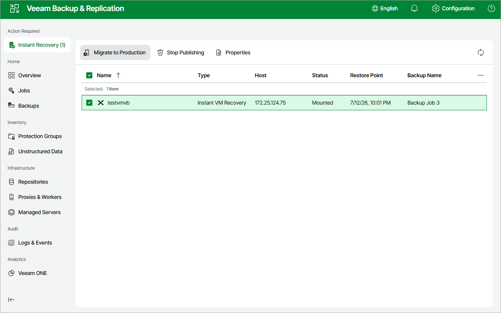

# Step 9. Finalize Instant Recovery

At the Summary step of the wizard, review summary information and click Finish.

|  |
| --- |
| Tip |
| If you want to start the recovered VM as soon as the restore process completes, select the Power on target VM after restoring check box. |

To finalize the instant recovery operation, do the following:

1. Navigate to Instant Recovery.
2. Select the recovered VM:

* To transfer VM disk data to the production storage, select Migrate to production.
* To remove the recovered VM, select Stop publishing.

|  |
| --- |
| Important |
| If you stop publishing a VM that was recovered to the same destination where the original VM resided, both the original and recovered VMs will be removed. |

Page updated 2026-07-16

