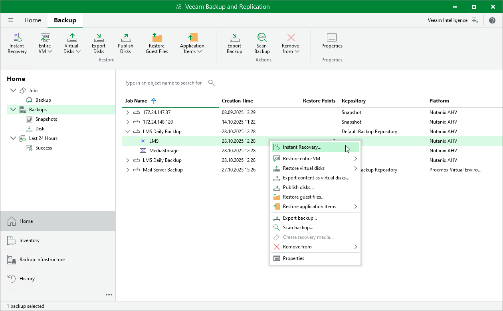

# Step 1. Launch Instant Recovery Wizard

To launch the Instant Recovery to Nutanix AHV wizard, do the following:

1. In the Veeam Backup & Replication console, open the Home view.
2. In the inventory pane, select Backups.

1. In the working area, expand the necessary backup job, right-click the VM you want to restore and select Instant recovery.

Alternatively, expand the necessary backup job, select the VM and click Instant Recovery on the ribbon.

