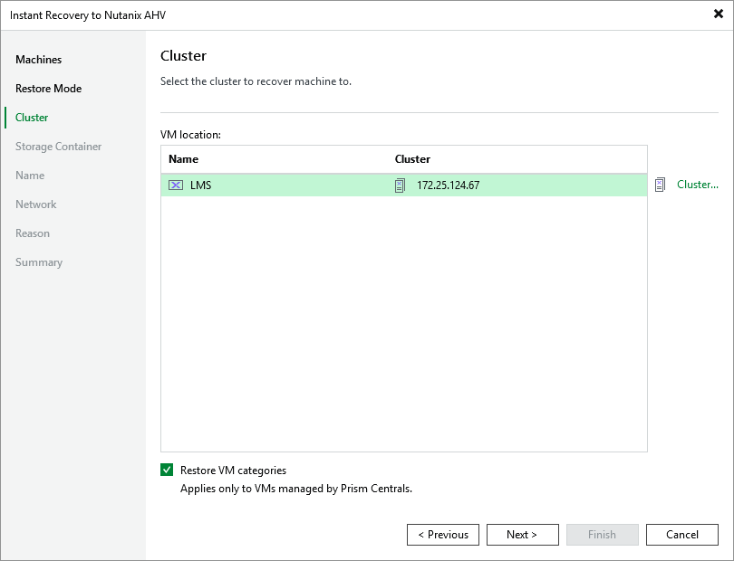

# Step 4. Specify Target Cluster

At the Cluster step of the wizard, choose the cluster to which the recovered VM will belong. In the Prism Central deployment, you can also choose whether you want the recovered VM to be assigned the same categories as the original VM.

For a cluster to be displayed in the list of the available clusters, it must be added to the backup infrastructure as described in section [Adding Nutanix AHV Server to Backup Infrastructure](ahv_add_ahv_cluster.md).

|  |
| --- |
| Important |
| If a selected VM has an attached volume group, the disks of the volume group will not be restored. |

