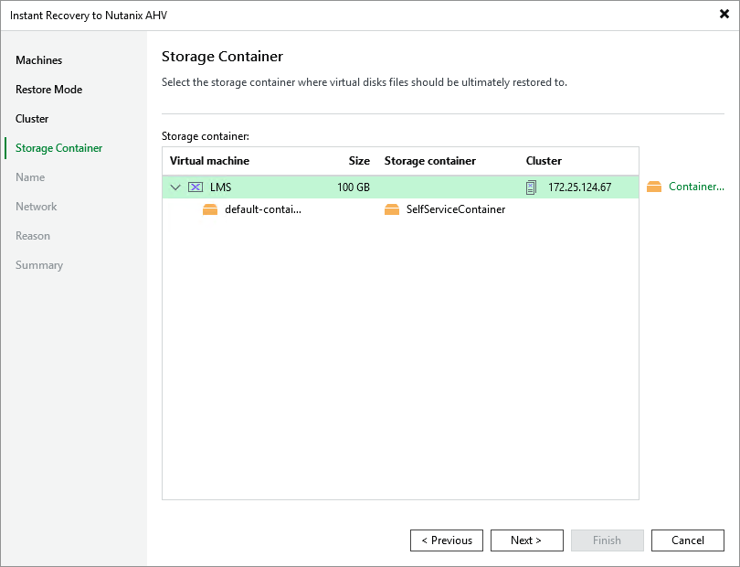

# Step 5. Select Storage Container

At the Storage Container step of the wizard, choose the storage container where virtual disks of the recovered VM will be stored.

For a container to be displayed in the list of the available containers, it must be configured in the Nutanix AHV cluster as described in [Nutanix documentation](https://portal.nutanix.com/page/documents/details?targetId=Web-Console-Guide-Prism:wc-storage-management-wc-c.html).

