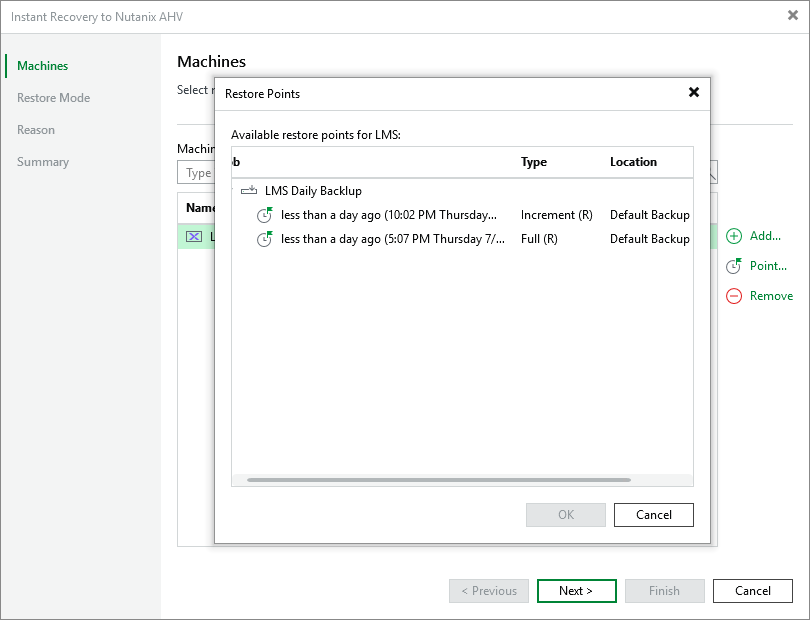

# Step 2. Select Restore Point

At the Machines step of the wizard, select a restore point that will be used to restore the selected VM. By default, Veeam Plug-in for Nutanix AHV uses the most recent valid restore point. However, you can restore the VM data to an earlier state.

To select a restore point, do the following:

1. Select the VM.
2. Click Point.
3. In the Restore Points window, select the necessary restore point and click OK.

To help you choose a restore point, Veeam Plug-in for Nutanix AHV provides the following information on each available restore point:

* Job — the name of the backup job that created the restore point and the date when the restore point was created.
* Type — the type of the restore point.
* Location — the repository where the restore point is stored.

You can use the wizard to restore multiple VMs at a time. To do that, click Add, select more VMs to restore and select a restore point for each of them.

