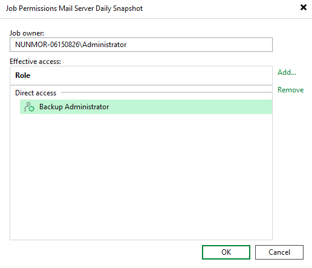

# Configuring Backup Job Permissions

By default, when a Veeam Backup & Replication user creates a backup job, they become able to view and manage this job as well as to use restore points created by the job to perform disaster recovery operations — depending on the [roles that are assigned to the user](configure_roles.md). However, you can also make another user the owner of the job, or allow other users to access this job and its restore points.

To specify the job permissions, do the following:

1. Open the Home view and navigate to Jobs > Backup.
2. In the working area, select the necessary job and click Permissions on the ribbon.

Alternatively, you can right-click the job and select Permissions.

1. In the Job Permissions window, click Change if you want to choose a new job owner, or click Add to define the list of roles assigned to users that will be able to perform administrative activities with this job.

For a user account to be displayed in the Select New Owner list, it must be created as described in section [Configuring Users](configuring_users.md). For a role to be displayed in the Select Roles list, it must be created as described in section [Configuring Roles](configure_roles.md#custom_roles).

|  |
| --- |
| Important |
| If you change the job owner, the previous owner will no longer be able to view or manage the job — unless you add the role assigned to this user to the Effective access list. |

Page updated 2026-07-16

