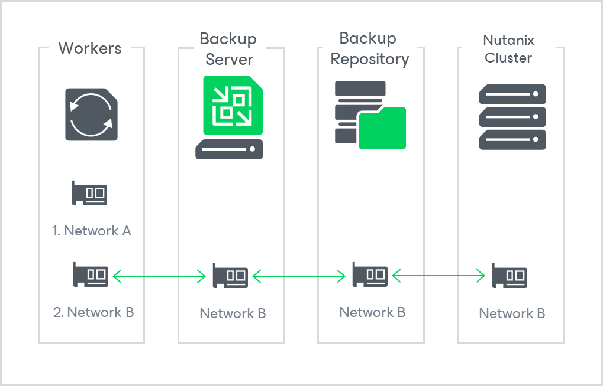
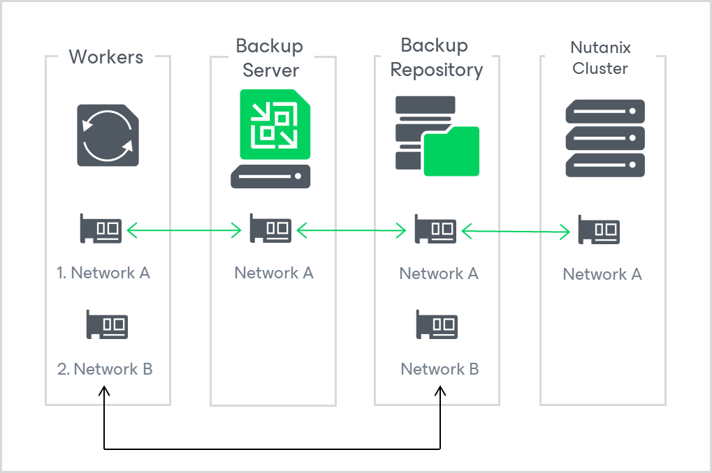
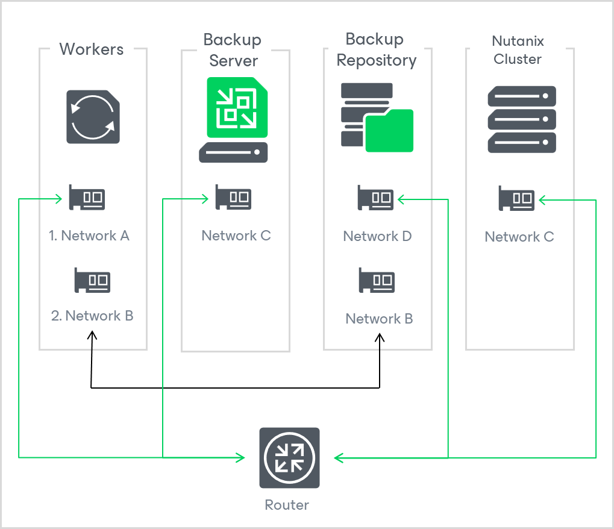
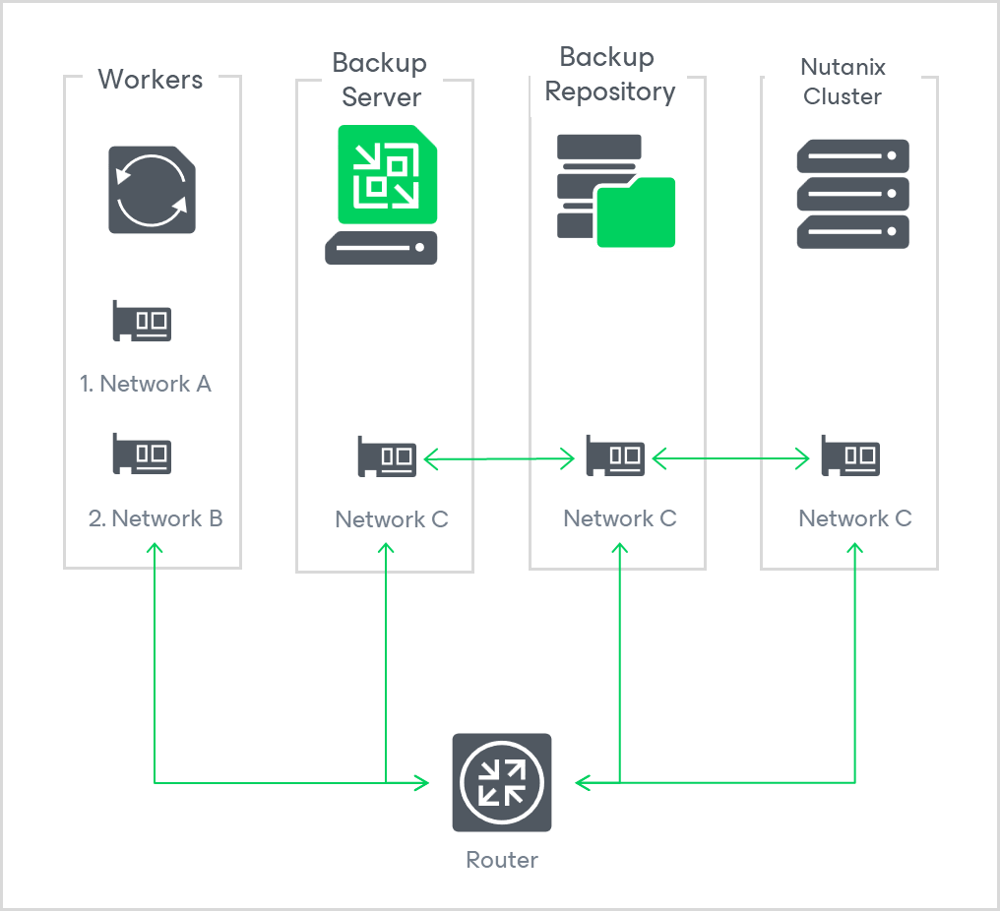

# Configuring Multiple Networks

Starting from version 6.0, Nutanix AHV allows you to connect workers to multiple networks. This may be helpful if your corporate policies require that inbound and outbound internet traffic is delivered through a secure network only, or if you want to use a specific network to transfer backed-up data from and to backup repositories.

Since workers deployed by Nutanix AHV are Linux-based VMs, they have the same limitations that apply to machines running the Rocky Linux operating system. That is, network routing can only be applied to the networks connected to the network adapters (vNICs) that have been added first while configuring workers, which means that these VMs can reach out to endpoints in other networks only through those first vNICs.

That is why you must consider the following while configuring multiple networks for workers:

* If you want workers to obtain updates from online Veeam repositories, you must connect to the first vNIC a network that allows inbound and outbound internet traffic.
* If a backup repository, the backup server or the Nutanix AHV server (cluster or Prism Central) is not reachable from the network connected to the first vNIC, you must update the worker settings to add one more vNIC and to connect it to the network to which that component is connected.

This section describes examples of valid and invalid network configurations.

Example 1. Valid Configuration

In this example, the workers, the backup server, the repository and the Nutanix AHV cluster are connected to Network B, while the workers are also connected to Network A that allows them to obtain updates from the internet. This configuration is valid since all backup infrastructure components are connected to the same network.

Example 2. Valid Configuration

In this example, the workers, the backup server, the repository and the Nutanix AHV cluster are connected to Network A, while the workers and the backup repository are also connected to Network B that is [configured as a preferred network](select_backup_network.md) to deliver traffic to the backup repository. This configuration is valid since all backup infrastructure components are connected to the same network.

|  |
| --- |
| Note |
| The workers will be able to obtain updates from online Veeam repositories only if Network A is configured to allow inbound and outbound internet traffic. |

Example 3. Valid Configuration

In this example, the workers are connected to Network A using their first vNICs, while the workers are also connected to Network B that is [configured as a preferred network](select_backup_network.md) to deliver traffic to the backup repository. Also, you have a router configured to forward traffic between networks A, C and D. This configuration is valid since the workers can use Network A to communicate with other backup infrastructure components though the router.

|  |
| --- |
| Note |
| The workers will be able to obtain updates from online Veeam repositories only if Network A is configured to allow inbound and outbound internet traffic. |

Example 4. Invalid Configuration

In this example, the workers are connected both to Network A using their first vNICs and to Network B using their second vNICs, while the backup server, the backup repository and the Nutanix cluster are connected to Network C. Also, you have a router configured to forward traffic between networks B and C. This configuration is invalid since the workers cannot use Network B to communicate with other backup infrastructure components through the router.

To make the configuration valid, do either of the following:

* Change your network configuration to connect Network A to the router.
* Add more vNICs to the workers. Then, connect these vNICs to Network C.

