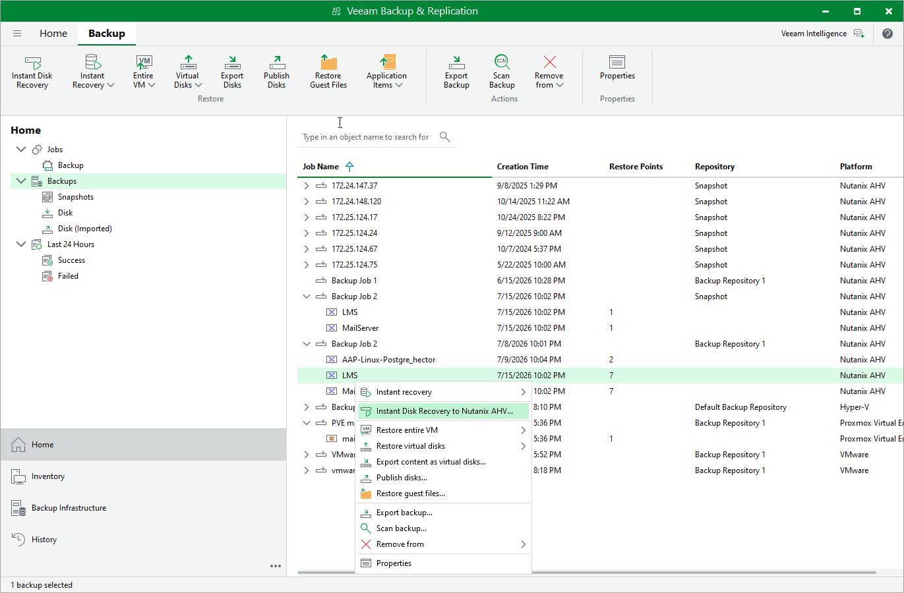

# Step 1. Launch Instant Disk Recovery Wizard

To launch the Instant Disk Recovery wizard, do the following:

1. In the Veeam Backup & Replication console, open the Home view.
2. In the inventory pane, select Backups.

1. In the working area, expand the necessary backup job, right-click the VM whose disk you want to recover and select Instant disk recovery to Nutanix AHV.

Alternatively, expand the necessary backup job, select the VM and click Instant Disk Recovery on the ribbon.

Page updated 2026-07-16

