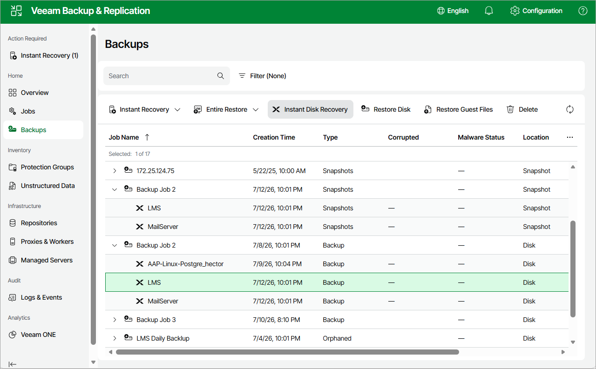

# Step 1. Launch Instant Disk Recovery Wizard

To launch the Instant Disk Recovery wizard, do the following:

1. Navigate to Backups.
2. Select the backup job that contains restore points for the VM disk that you want to restore.
3. Click Instant Disk Recovery.

Page updated 2026-07-16

