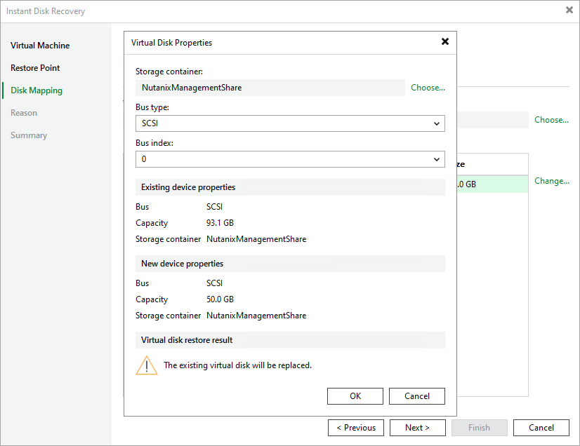

# Step 4. Configure Mapping Settings

At the Disk Mapping step of the wizard, do the following:

1. Click Choose.
2. Choose a target VM to which you want to attach the restored disks.

By default, Veeam Plug-In for Nutanix AHV attaches the restored disks to the original VM.

|  |
| --- |
| Important |
| During disk restore, Veeam Plug-In for Nutanix AHV turns off the target VM to reconfigure its settings and attach the restored disk. It is recommended that you stop all activities on the target VM till the restore session completes. |

1. Select a virtual disk to restore and click Change.

By default, Veeam Plug-In for Nutanix AHV attaches the restored disk to the target VM as a new disk. However, if you want the restored disk to replace the existing disk, or if you want to change the disk bus type and to specify a storage container for the restored disk, configure disk settings.

|  |
| --- |
| Note |
| You can select a storage container only if you restore from a backup. |

Page updated 2026-07-16

