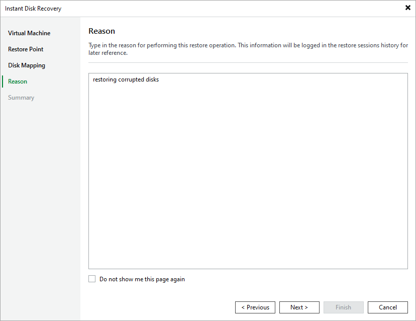

# Step 5. Specify Reason for Restore

At the Reason step of the wizard, specify a reason for restoring disks. This information will be saved to the session history, and you will be able to reference it later.

Page updated 2026-07-16

