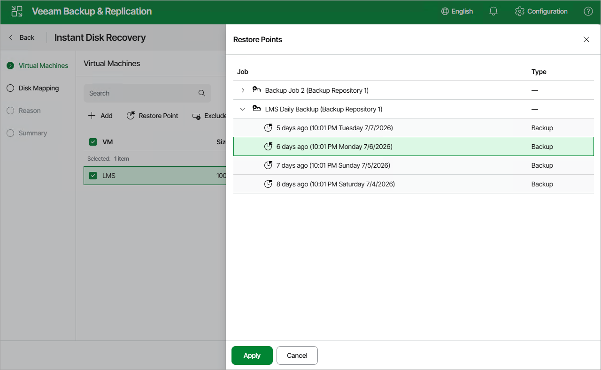

# Step 2. Select Restore Point

At the Virtual Machine step of the wizard, select a restore point that will be used to restore data. By default, Veeam Plug-In for Nutanix AHV uses the most recent valid restore point. However, you can restore the data to an earlier state.

|  |
| --- |
| Note |
| While creating a backup, Veeam Plug-In for Nutanix AHV takes a VM snapshot that is called backup snapshot. Veeam Plug-In for Nutanix AHV stores a recent backup snapshot for each backup job. Restore from a backup snapshot is significantly faster than restore from a backup. |

To select a restore point, do the following:

1. Select the VM.
2. Click Restore Point.
3. In the Select restore point window, select the necessary restore point and click Apply.

To help you choose a restore point, Veeam Plug-In for Nutanix AHV provides the following information on each available restore point:

* Job — the name of the backup job that created the restore point.
* Type — the type of the restore point:

* Backup — an image-level backup created by a backup job.

[Applies to the [Prism Central deployment](ahv_infrastructure_prism_central.md)] Only backups are supported for restore to another cluster.

* Snapshot — a snapshot created by a backup job.

|  |
| --- |
| Tip |
| By default, Veeam Plug-In for Nutanix AHV restores all disks attached to the selected VMs. If you want to exclude specific disks of a VM from restore, do the following. Select a VM, click Exclusions and select the disks to exclude. |

Page updated 2026-07-16

