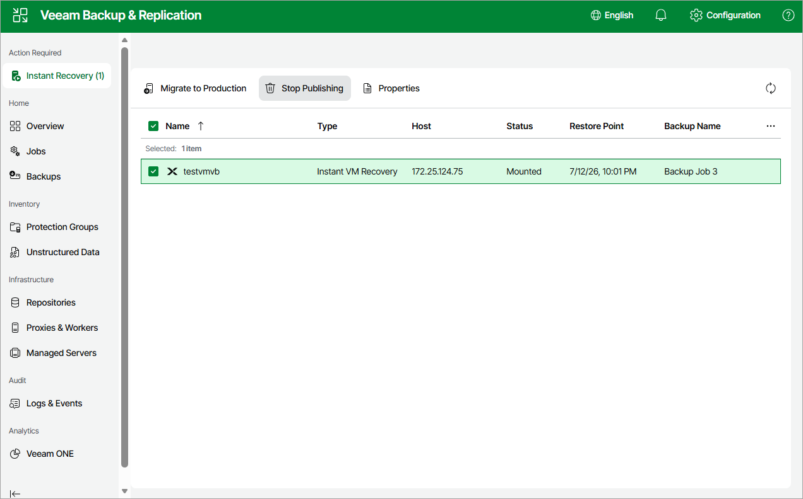

# Step 5. Finalize Instant Recovery

At the Summary step of the wizard, review summary information and click Finish.

|  |
| --- |
| Tip |
| If you want to start the VM with recovered disks as soon as the restore process completes, select the Power on VM after restore check box. |

To finalize the instant recovery operation, do the following:

1. Navigate to Instant Recovery.
2. Select the VM with recovered disks:

* To transfer VM disk data to the production storage, select Migrate to production.
* To remove the VM with recovered disks, select Stop publishing.

|  |
| --- |
| Important |
| If you stop publishing a VM that was recovered to the same destination where the original VM resided, both the original and recovered VMs will be removed. |

Page updated 2026-07-16

