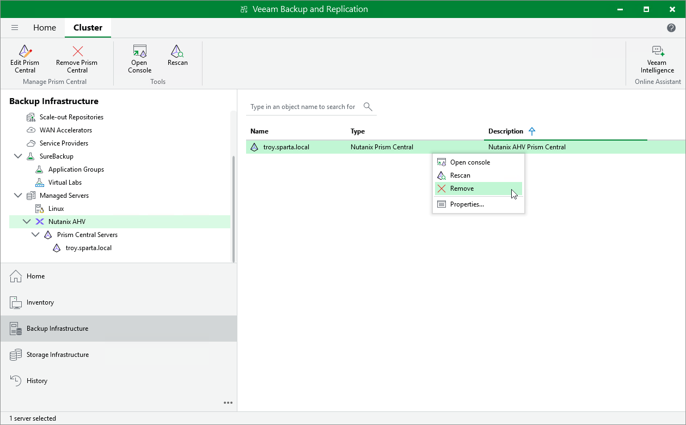

# Removing Nutanix AHV Server

If you do not want to protect resources managed by the connected Prism Central or cluster anymore, you can remove it from the backup infrastructure.

To remove the Prism Central or cluster from the backup infrastructure:

1. Open the Backup Infrastructure view.
2. In the inventory pane, select Managed Servers > Nutanix AHV.
3. In the working area, select the Prism Central or cluster and click Remove on the ribbon, or right-click the Prism Central or cluster and select Remove.

