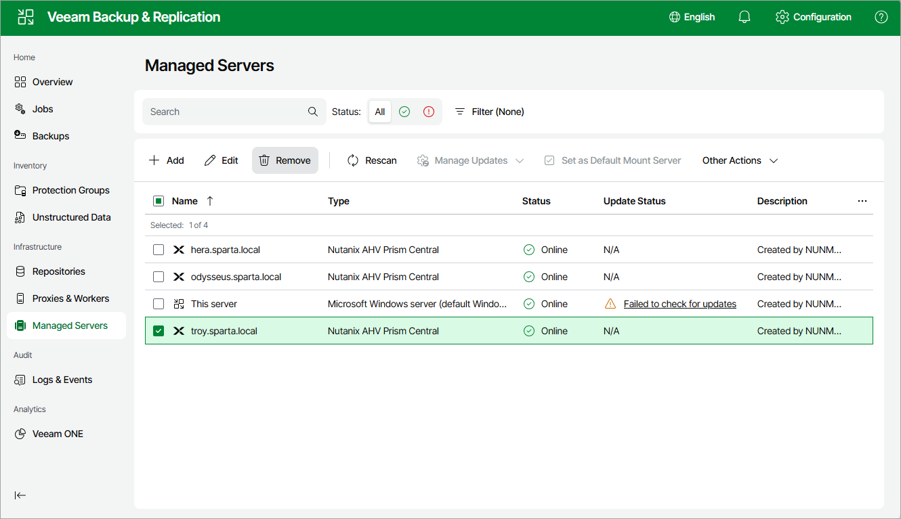

# Removing Nutanix AHV Server

If you do not want to protect resources managed by the connected Prism Central or cluster anymore, you can remove it from the backup infrastructure. To do that:

1. Navigate to Managed Servers.
2. Select the necessary Prism Central or cluster and click Remove on the menu, or right-click the Prism Central or cluster and select Remove.

Page updated 2026-07-06

