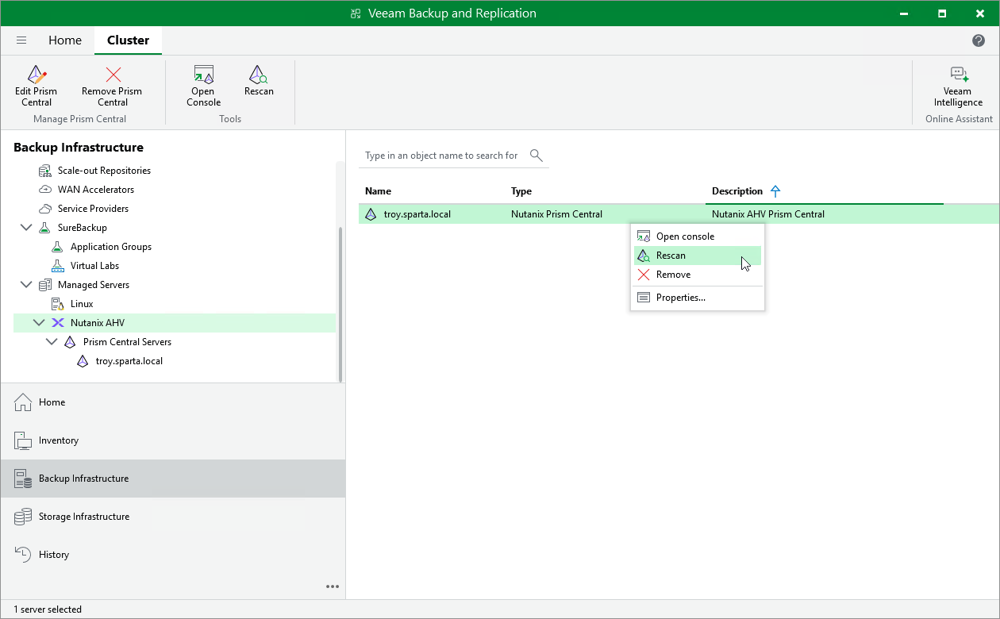

# Rescanning Nutanix AHV Server

Veeam Backup & Replication retrieves information about the Nutanix AHV resources from the Prism Central or cluster. However, the data synchronization process may take some time to complete. If you make any changes to the Nutanix AHV environment and want both the Veeam Backup & Replication console to display the changes immediately, you can rescan the Prism Central or cluster manually.

To rescan the Prism Central or cluster, do the following:

1. Open the Backup Infrastructure view.
2. In the inventory pane, select Managed Servers > Nutanix AHV.
3. In the working area, select the Prism Central or cluster and click Rescan on the ribbon, or right-click the Prism Central or cluster and select Rescan.

|  |
| --- |
| Tip |
| In the System window, you can track the progress of the rescan session. You can close the window and check session details later as described in section [Viewing History Statistics](history_statistics.md). |

