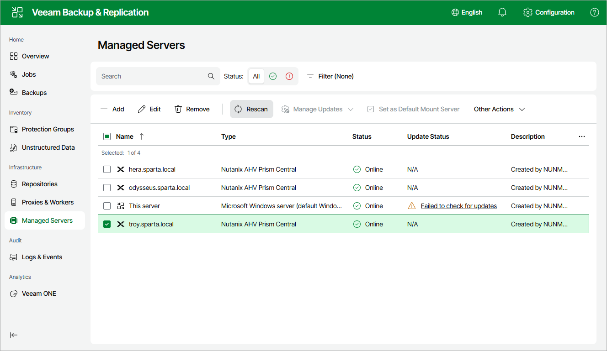

# Rescanning Nutanix AHV Server

Veeam Backup & Replication retrieves information about the Nutanix AHV resources from the Prism Central or cluster. However, the data synchronization process may take some time to complete. If you make any changes to the Nutanix AHV environment and want the Veeam Backup & Replication Web UI to display the changes immediately, you can rescan the Prism Central or cluster manually.

To rescan the Prism Central or cluster, do the following:

1. Navigate to Managed Servers.

1. Select the necessary Prism Central or cluster and click Rescan on the menu, or right-click the Prism Central or cluster and select Rescan.

|  |
| --- |
| Tip |
| You can track the progress of the rescan session on the Logs and Events page. To check the session details, switch to the Session Logs tab and open the Status window as described in section [Viewing Logs and Events](history_statistics_web.md). |

Page updated 2026-07-07

