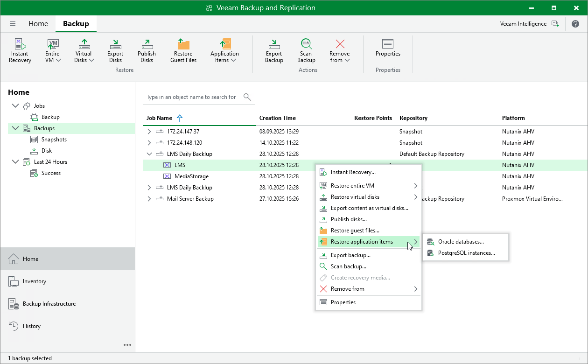

# Performing Application Item Restore

With application item restore, you can use backups to restore the following data:

* Microsoft Active Directory objects and containers
* Microsoft Exchange mailboxes, folders and messages
* Microsoft SharePoint sites and lists
* Microsoft SQL Server
* Oracle databases

|  |
| --- |
| Note |
| It is recommended that you use [application-consistent backups](ahv_backup_job_vbr_guest_processing.md) for application item restore. |

To restore application items from a VM backup, do the following:

1. Open the Home view.
2. In the inventory pane, select Backups.
3. In the working area, expand the necessary backup job, right-click the VM that contains an application you want to restore, select Restore application items and select the application.

Alternatively, expand the necessary backup job, select the VM, click Application Items on the ribbon and select the application.

|  |
| --- |
| Tip |
| To restore application items from a backup snapshot, expand the job that contains the snapshot of the VM, right-click the VM and select Restore application items. |

1. In the restore wizard, select a restore point that will be used to restore the application, specify a restore reason and click Browse.
2. Use the [Veeam Explorers application](restore_veeam_explorers.md) to proceed with the restore operation.

|  |
| --- |
| Tip |
| As an alternative to application item restore, you can also [perform file-level restore](pve_vm_guest_restore.md) to recover standalone databases using Veeam Explorers. |

