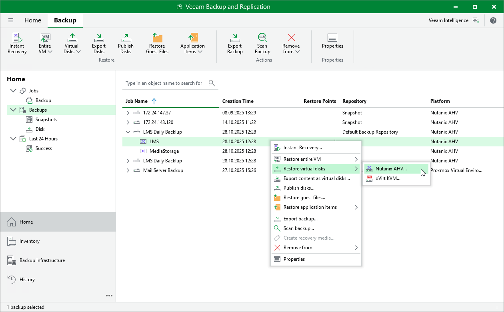

# Step 1. Launch Virtual Disk Restore Wizard

To launch the Virtual Disk Restore wizard, do the following:

1. In the Veeam Backup & Replication console, open the Home view.
2. In the inventory pane, select Backups.

1. In the working area, expand the necessary backup job, right-click the VM you want to restore and select Restore virtual disks > Nutanix AHV.

Alternatively, expand the necessary backup job, select the VM and click Virtual Disks > Nutanix AHV on the ribbon.

|  |
| --- |
| Tip |
| To restore a VM from a backup snapshot, expand the job that contains the snapshot of the VM, right-click the VM and select Restore entire VM to Nutanix AHV. |

