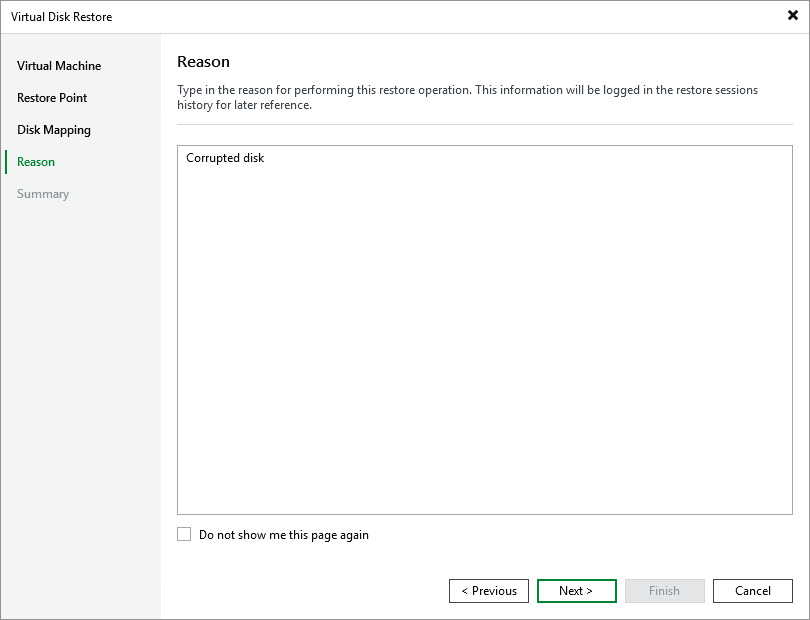

# Step 5. Specify Reason for Restore

At the Reason step of the wizard, specify a reason for restoring the disks. This information will be saved to the session history, and you will be able to reference it later.

