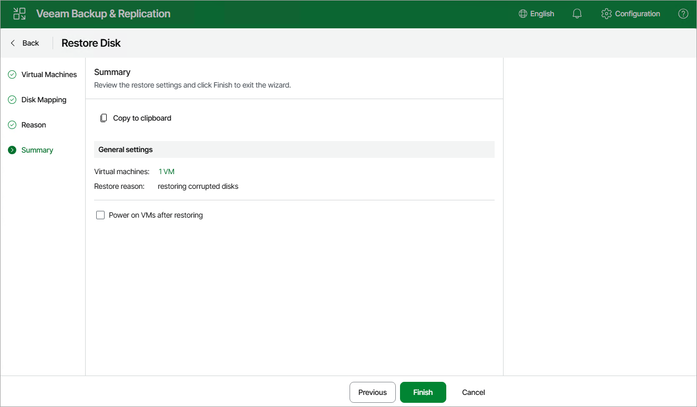

# Step 5. Finish Working with Wizard

At the Summary step of the wizard, review summary information and click Finish.

|  |
| --- |
| Tip |
| If you want to start the VM with recovered disks as soon as the restore process completes, select the Power on VMs after restore check box. |

Page updated 2026-07-10

