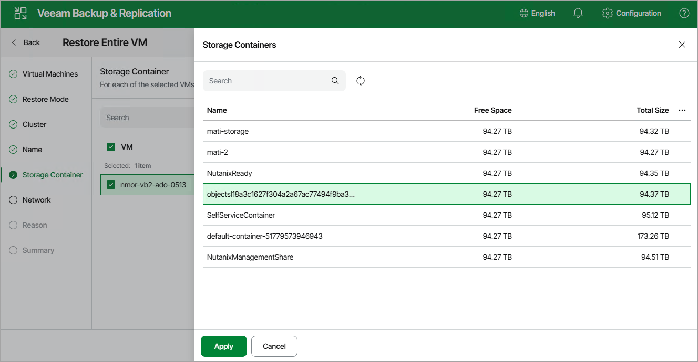

# Step 6. Select Storage Container

[This step applies only if you have selected the Restore to new location option at the Restore Mode step of the wizard]

At the Storage Container step of the wizard, choose the storage container where virtual disks of the recovered VM will be stored.

|  |
| --- |
| Note |
| You cannot choose a storage container when restoring a VM from a snapshot. |

For a container to be displayed in the list of the available containers, it must be configured in the cluster as described in [Nutanix documentation](https://portal.nutanix.com/page/documents/details?targetId=Web-Console-Guide-Prism:wc-storage-management-wc-c.html).

Page updated 2026-07-10

