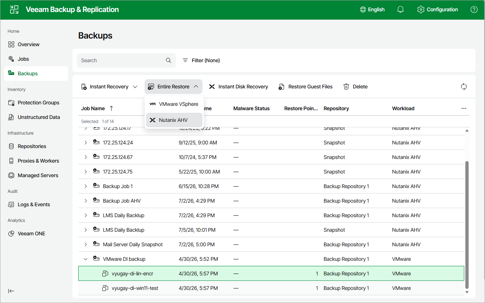

# Step 1. Launch Full VM Restore Wizard

To launch the Full VM Restore wizard, do the following:

1. Navigate to Backups.
2. Select the backup job that contains restore points for the VM that you want to restore.
3. Click Entire Restore > Nutanix AHV.

Page updated 2026-07-16

