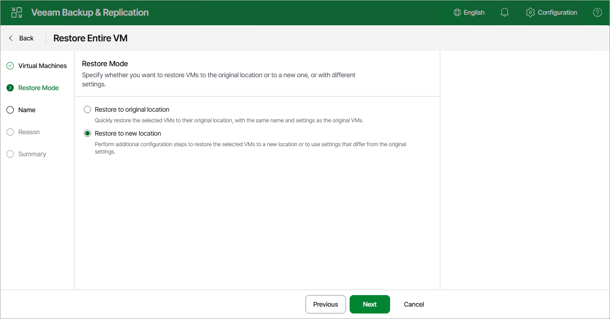

# Step 3. Choose Restore Mode

At the Restore Mode step, choose whether you want to restore the VM with the original settings or to specify new settings (such as VM network and disk storage settings).

Page updated 2026-07-06

