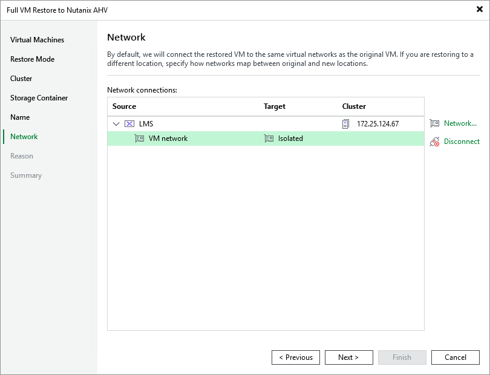

# Step 7. Configure Network Settings

[This step applies only if you have selected the Restore to a new location, or with different settings option at the Restore Mode step of the wizard]

At the Network step of the wizard, choose a network to which the recovered VM will be connected. If you do not want to connect the VM to any virtual network, select the VM and click Disconnect.

For a network to be displayed in the list of the available networks, it must be configured in the Nutanix AHV cluster as described in [Nutanix documentation](https://portal.nutanix.com/page/documents/details?targetId=Web-Console-Guide-Prism-v7_3:wc-network-management-wc-c.html).

|  |
| --- |
| Note |
| You cannot change network settings when restoring the VM from a snapshot. However, when restoring the VM from a [user snapshot](ahv_nutanix_snapshots.md), you can choose to disconnect the original network. |

