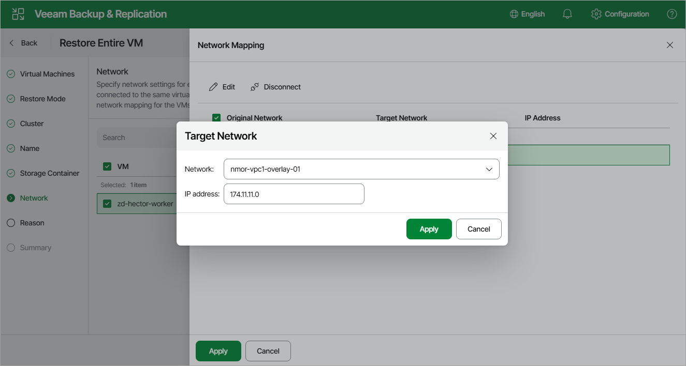

# Step 7. Configure Network Settings

[This step applies only if you have selected the Restore to new location option at the Restore Mode step of the wizard]

At the Network Settings step of the wizard, choose a network to which the recovered VM will be connected. If you do not want to connect the VM to any virtual network, click Disconnect.

|  |
| --- |
| Note |
| You cannot change network settings when restoring the VM from a PD snapshot or a snapshot created in the Nutanix AHV Prism console. |

For a network to be displayed in the list of the available networks, it must be configured in the cluster as described in [Nutanix documentation](https://portal.nutanix.com/page/documents/details?targetId=Web-Console-Guide-Prism-v6_5:wc-network-management-wc-c.html).

Page updated 2026-07-10

