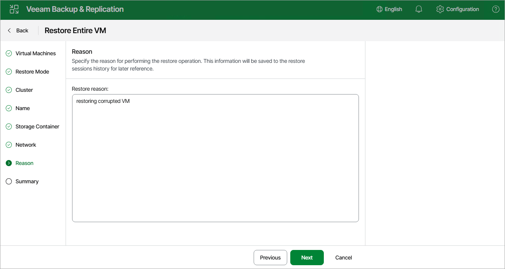

# Step 8. Specify Reason for Restore

At the Reason step of the wizard, specify a reason for restoring the VM. This information will be saved to the session history, and you will be able to reference it later. 

Page updated 2026-07-06

