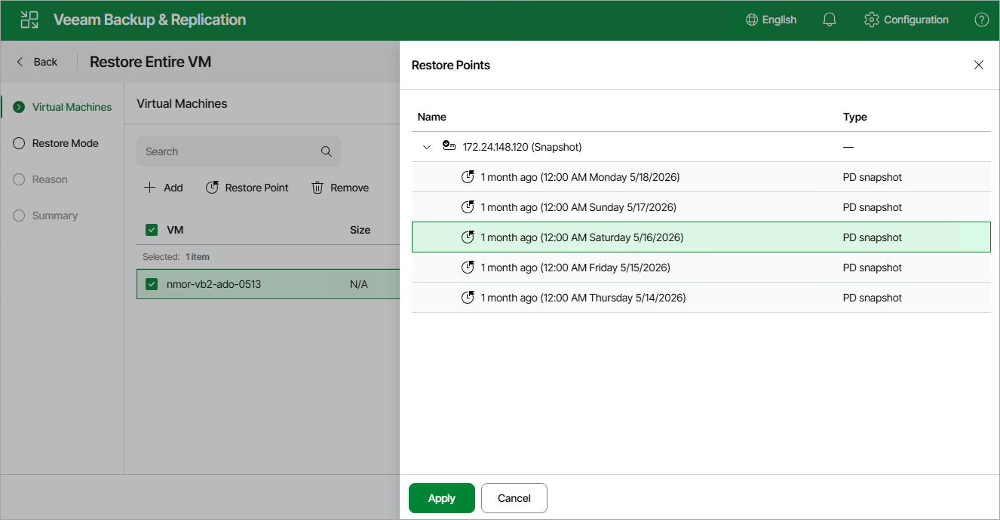

# Step 2. Select Restore Point

At the Virtual Machines step of the wizard, select a restore point that will be used to restore the selected VM. By default, Veeam Plug-in for Nutanix AHV uses the most recent valid restore point. However, you can restore the VM data to an earlier state.

To select a restore point, do the following:

1. Select the VM.
2. Click Restore Point.
3. In the Restore Points window, select the necessary restore point and click Apply.

To help you choose a restore point, Veeam Plug-in for Nutanix AHV provides the following information on each available restore point:

* Name — the name of the backup job that created the restore point.
* Type — the type of the restore point:

* Backup — an image-level backup created by a backup job.

[Applies to the [Prism Central deployment](ahv_infrastructure_components.md)] Only backups are supported for restore to another cluster.

* Backup snapshot — a snapshot created by a backup job.
* Snapshot — a snapshot created by a snapshot job or manually taken in the Nutanix AHV Prism Element console.

|  |
| --- |
| Tip |
| While creating a backup, Veeam Plug-in for Nutanix AHV takes a VM snapshot that is called backup snapshot. Veeam Plug-in for Nutanix AHV stores a recent backup snapshot for each backup job. Restore from the backup snapshot is significantly faster than restore from a backup. However, when you restore from the backup snapshot, [limitations are applied](ahv_restore_to_ahv_byb_web.md). For more information on snapshots, see [Snapshot Types](ahv_nutanix_snapshots.md), |

You can use the wizard to restore multiple VMs at a time. To do that, click Add, select more VMs to restore and select a restore point for each of them.

Page updated 2026-07-16

