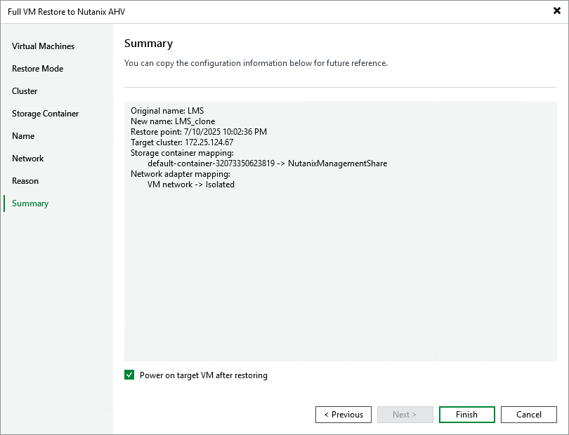

# Step 9. Finish Working with Wizard

At the Summary step of the wizard, review summary information and click Finish.

|  |
| --- |
| Tip |
| If you want to start the recovered VM as soon as the restore process completes, select the Power on target VM after restoring check box. |

