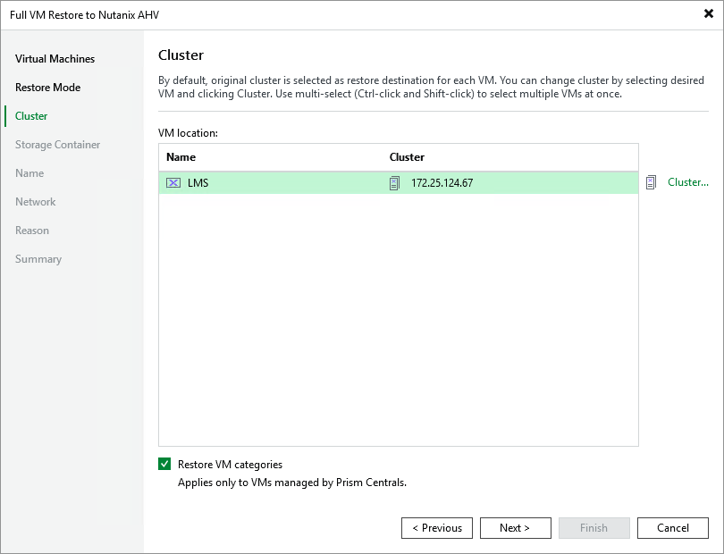

# Step 4. Specify Target Cluster

[This step applies only if you have selected the Restore to a new location, or with different settings option at the Restore Mode step of the wizard]

At the Cluster step of the wizard, choose the cluster to which the recovered VM will belong. In the Prism Central deployment, you can also choose whether you want the recovered VM to be assigned the same categories as the original VM.

For a cluster to be displayed in the list of the available clusters, it must be added to the backup infrastructure as described in section [Adding Nutanix AHV Server to Backup Infrastructure](ahv_add_ahv_cluster.md).

|  |
| --- |
| Note |
| The Cluster step of the Full VM Restore to Nutanix AHV wizard is only available when you restore the VM from a backup. |

