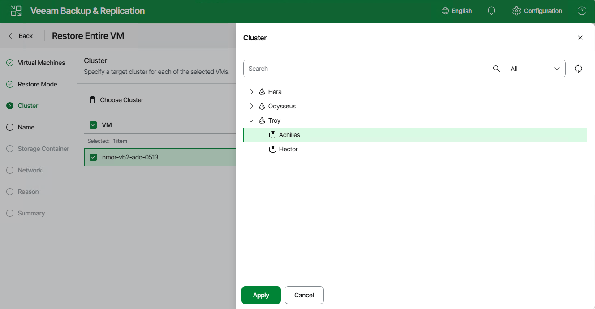

# Step 4. Specify Target Cluster

[This step applies only if you have selected the Restore to new location option at the Restore Mode step of the wizard in the Prism Central deployment]

At the Cluster step of the wizard, choose the cluster or prism central to which the recovered VM will belong.

|  |
| --- |
| Note |
| The Cluster step of the Full VM Restore wizard is only available when you restore the VM from a backup. |

Page updated 2026-07-17

