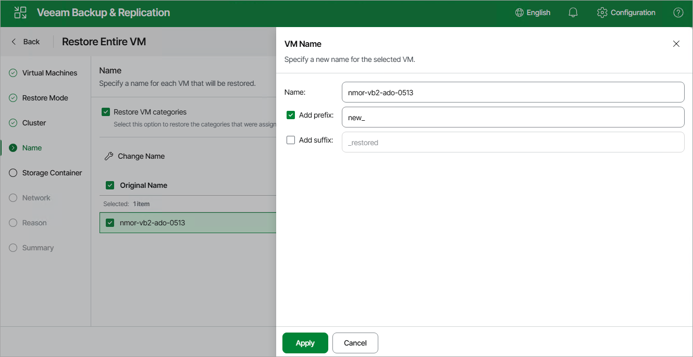

# Step 5. Specify VM Name

[This step applies only if you have selected the Restore to new location, or with different settings option at the Restore Mode step of the wizard]

At the Name step of the wizard, you can specify a new name for the recovered VM. You can also choose whether you want the recovered VM to be assigned the same categories as the original VM.

Page updated 2026-07-10

