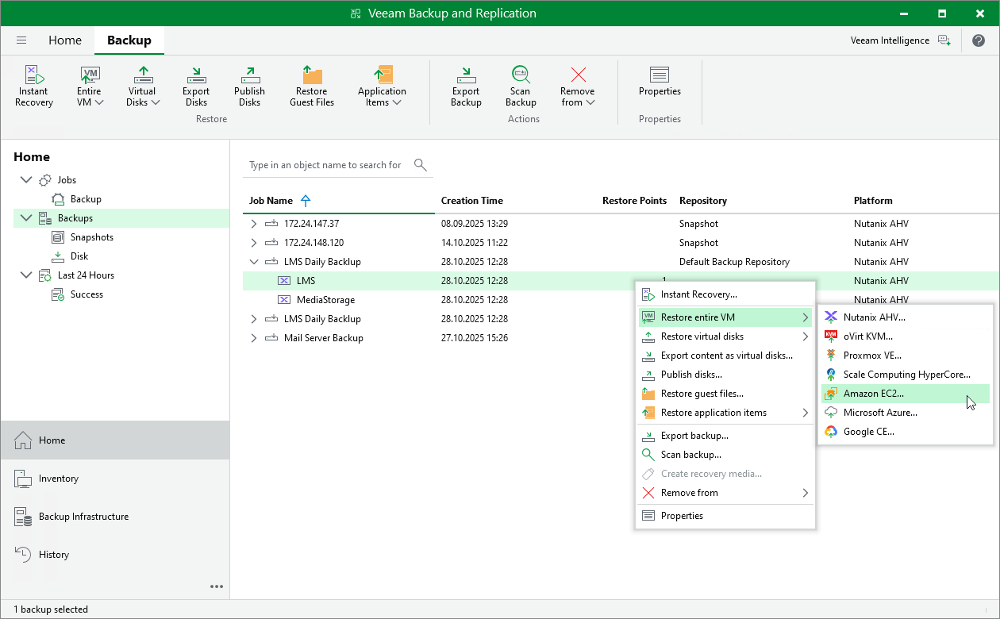

# Performing VM Restore to Amazon Web Services

Veeam Backup & Replication allows you to restore VMs to Amazon Web Services (AWS) as EC2 instances. For more information, see [Restore to Amazon EC2](restore_amazon.md).

To restore a VM to Amazon EC2, do the following:

1. Open the Home view.
2. In the inventory pane, select Backups.
3. In the working area, expand the necessary backup job, right-click the VM that you want to restore and select Amazon EC2.

Alternatively, expand the necessary backup job, select the VM and click Entire VM > Amazon EC2 on the ribbon.

1. Complete the Restore to Amazon EC2 wizard as described in section [Restoring to Amazon EC2](restore_amazon_process.md).

