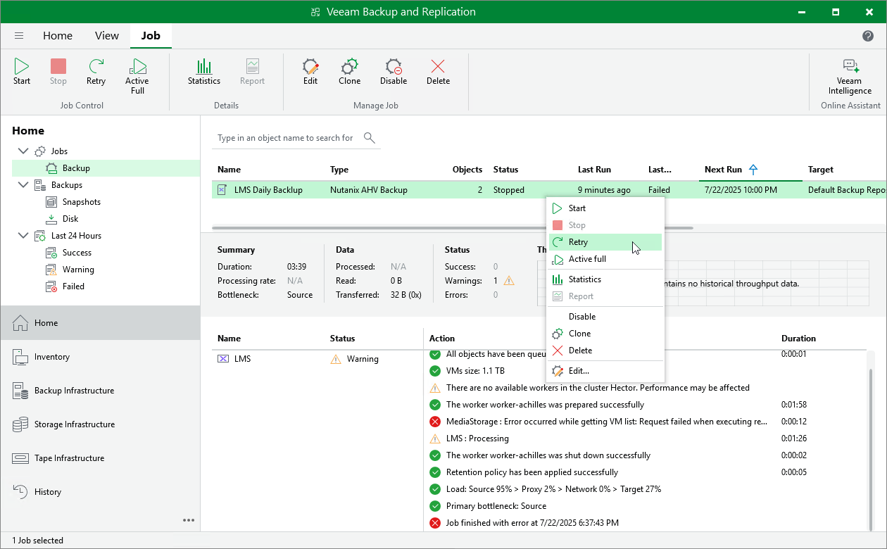

# Retrying Jobs

If a job fails, you can retry the backup operation. When you perform a retry, Veeam Backup & Replication restarts the operation only for the failed resources added to the job and does not process VMs that have been processed successfully. As a result, retrying a job takes less time compared to restarting the job for all resources.

To retry a job, do the following:

1. Open the Home view.
2. In the inventory pane, select Jobs.
3. In the working area, right-click the necessary job and select Retry.

Alternatively, select the job and click Retry on the ribbon.

