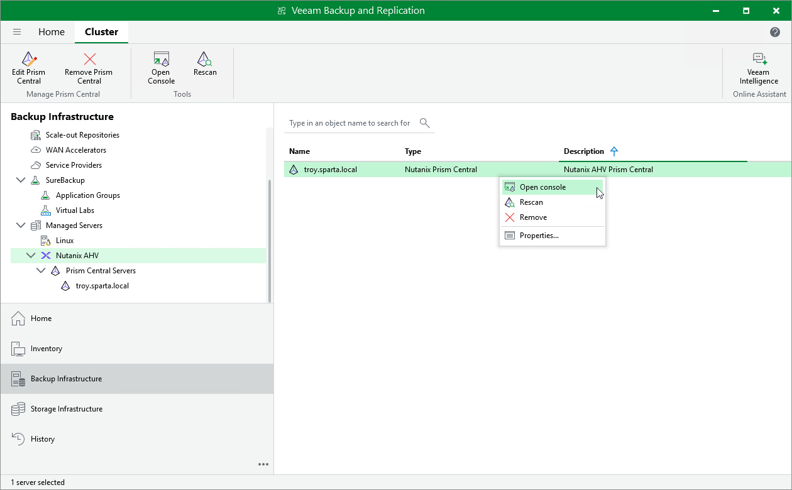
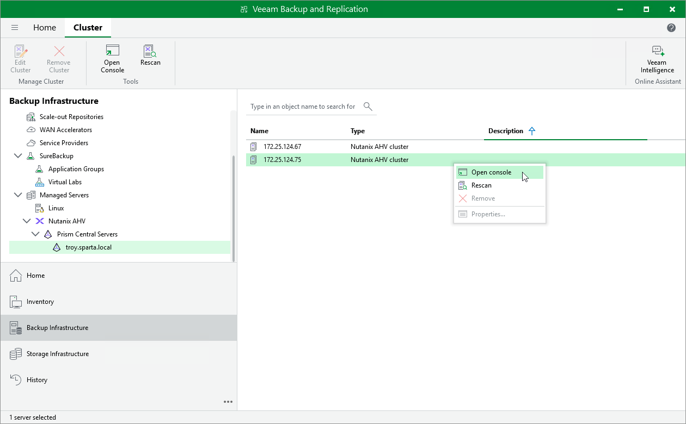

# Accessing Nutanix AHV Server Console

If you want to check the configuration of your Nutanix AHV infrastructure, you can use Veeam Backup & Replication to launch the Prism Central console or the Prism Element console.

To access the Prism Central console, do the following:

1. In the Veeam Backup & Replication console, open the Backup Infrastructure view.
2. In the inventory pane, select Managed Servers > Nutanix AHV.
3. Select the Prism Central and click Open Console on the ribbon, or right-click the Prism Central and select Open Console.

To access the Prism Element console, do the following:

1. In the Veeam Backup & Replication console, open the Backup Infrastructure view.
2. In the inventory pane, select Managed Servers > Nutanix AHV.
3. Select a standalone cluster or a cluster registered with the Prism Central and click Open Console on the ribbon, or right-click a cluster and select Open Console.

