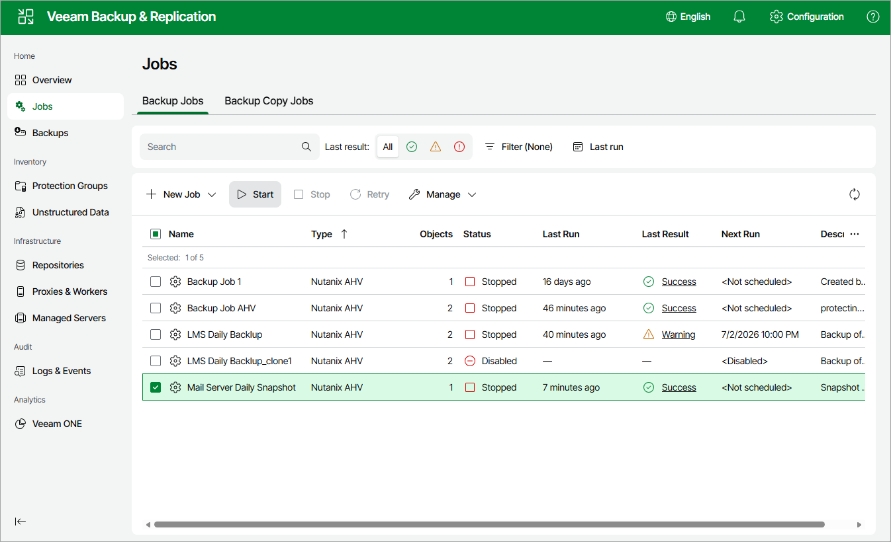

# Starting and Stopping Jobs

You can start a job manually, for example, if you want to create an additional restore point and do not want to modify the configured job schedule. You can also stop a job manually if processing of a VM is about to take too long, and you do not want the job to have an impact on the production environment during business hours. When you stop a running job, Veeam Backup & Replication creates a new restore point only for those VMs that have already been processed by the time you stop the job.

To start or stop a job, do the following:

1. Navigate to Jobs.
2. Select the necessary job.
3. Click Start or Stop.

Page updated 2026-07-13

