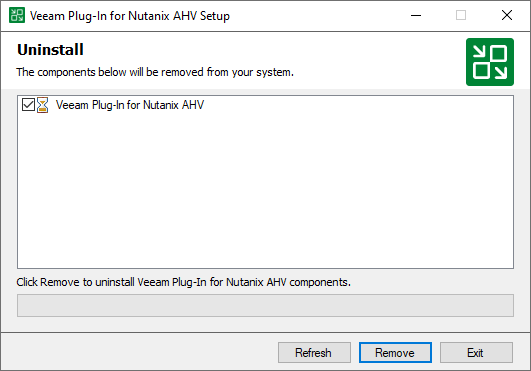

# Uninstalling Veeam Plug-In for Nutanix AHV

After you remove Veeam Plug-in for Nutanix AHV, the following will happen:

* You will be able to see information on snapshots in the Veeam Backup & Replication console. However, you will not be able to perform any operations with these snapshots.
* You will be able to see information on image-level backups of VMs and perform data recovery operations using these backups. However, you will not be able to perform entire VM restore to Nutanix AHV.

|  |
| --- |
| Tip |
| Before you uninstall Veeam Plug-in for Nutanix AHV, it is recommended to [remove all workers](ahv_workers_remove.md) from the backup infrastructure. |

To uninstall Veeam Plug-in for Nutanix AHV, do the following:

1. Log in to the backup server using an account with the Local Administrator permissions.
2. Open the Start menu and click the Control Panel icon.
3. In the Settings window, navigate to System > Apps and Features.
4. In the program list, select Veeam Plug-in for Nutanix AHV. Then, click Uninstall.
5. In the opened window, click Remove.

Related Topics

* [Removing Workers](ahv_workers_remove.md)
* [Removing Nutanix AHV Server](ahv_removing_cluster.md)

