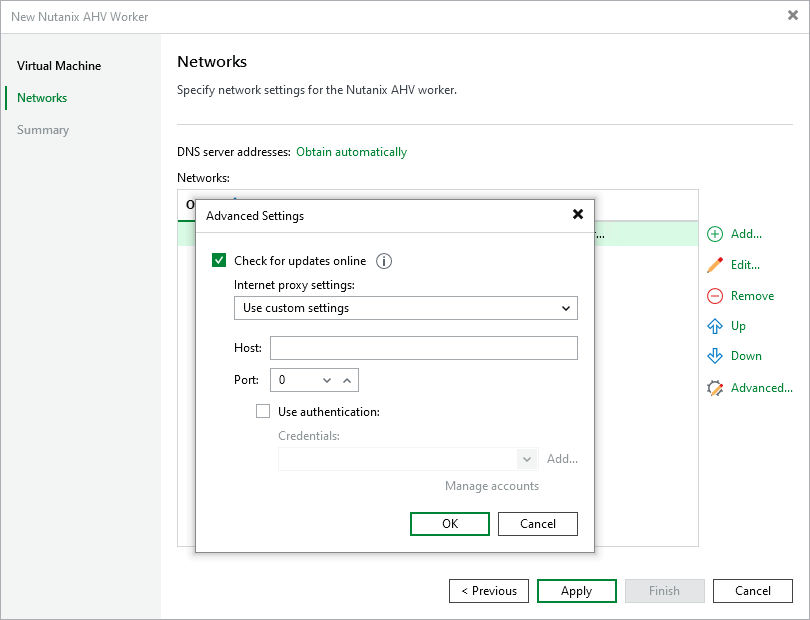

# Step 3. Configure Network Settings

At the Networks step of the wizard, choose a network to which the worker VM will be connected:

1. Click Add.
2. In the Network Settings window, do the following:

1. Use the Network and Description fields to select the necessary network and to provide a description for this network connection. For a network to be displayed in the list of the available networks, it must be configured in the Nutanix AHV cluster as described in [Nutanix documentation](https://portal.nutanix.com/page/documents/details?targetId=Web-Console-Guide-Prism-v7_3:wc-network-management-wc-c.html).

To optimize worker performance, it is recommended that you select the network to which the Nutanix Controller VMs (CVMs) are connected.

1. If DHCP is enabled in the selected network, the IP address of the worker VM will be obtained automatically. If DHCP is disabled in the selected network or if you want to specify an IP address manually, select the Use the following IP address option and enter the necessary IP address, subnet mask and default gateway.

1. Repeat steps 1–2 to add more network interfaces. For more information on multi-network configuration, see [Configuring Multiple Networks](ahv_multiple_networks.md).

|  |
| --- |
| Note |
| If DHCP is enabled in any of the specified networks, Veeam Backup & Replication will try to obtain DNS settings automatically. If DHCP is disabled or if you want to specify DNS settings manually, click Obtain automatically, select the Use the following DNS server addresses option in the DNS Server Settings window and specify the necessary IP addresses. Keep in mind that DNS settings cannot be configured separately for each network added to the worker. |

Configuring Internet Proxy for Updates

To check for available package updates for the worker, Veeam Backup & Replication automatically connects to Veeam repositories over the internet. If the worker is not connected to the internet, Veeam Backup & Replication uses [backup server update settings](update_appliance_configure_updates.md) to obtain the configuration of an internet proxy that provides access to the necessary repositories. However, you can enter specific internet proxy settings that will be used for the current worker. To do that, click Advanced and do the following in the Advanced Settings window:

1. From the Internet proxy settings drop-down list, select Use custom settings.
2. In the Host field, enter a DNS name or an IPv4 address of the internet proxy.
3. In the Port field, enter the port used on the internet proxy for HTTP or HTTPS connections.
4. If your internet proxy requires authentication, select the Use authentication check box, and select credentials of the account configured on the proxy to access the internet.

For credentials to be displayed in the Credentials list, they must be added to the Credentials Manager as described in section [Standard Accounts](credentials_manager_windows.md). If you have not added the necessary credentials to the Credentials Manager beforehand, you can do this without closing the wizard.

|  |
| --- |
| Tip |
| If the worker does not have access to the internet and no internet proxy is configured for the worker, you can instruct Veeam Backup & Replication not to update it. To do that, clear the Check for updates online check box. |

