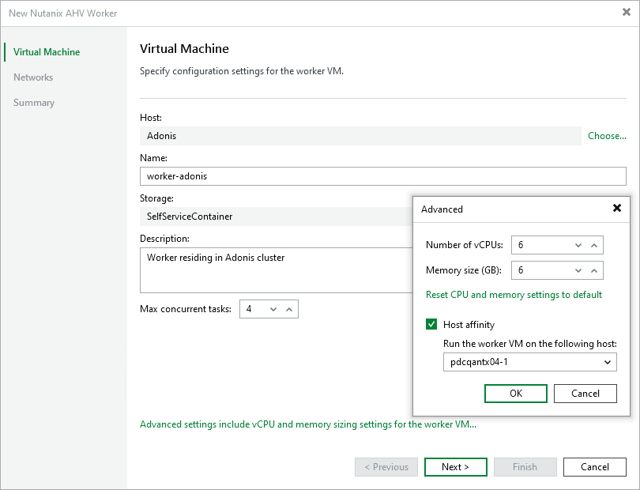

# Step 2. Specify Worker VM Settings

At the Virtual Machine step of the wizard, do the following:

1. Click Choose next to the Host field to specify a cluster where the worker will reside.

[Applies only to the [Prism Central deployment](ahv_infrastructure_prism_central.md)] For a cluster to be displayed in the list of the available clusters, it must be configured in the Nutanix AHV Prism Central as described in [Nutanix documentation](https://portal.nutanix.com/page/documents/details?targetId=Prism-Central-Guide-vpc_7_3:mul-register-wc-t.html).

[Applies only to the [standalone cluster deployment](ahv_infrastructure_cluster.md)] For a cluster to be displayed in the list of the available clusters, it must added to the backup infrastructure as described in section [Adding Nutanix AHV Server to Backup Infrastructure](ahv_add_ahv_cluster.md).

1. In the Name field, specify a name for the worker. The maximum length of the name is 63 characters; the following characters are only supported: a-z, A-Z, 0-9, -.
2. Check the Storage field to see the storage container that is automatically selected for worker system file.
3. In the Description field, provide a description for future reference. The maximum length of the description is 1024 characters.
4. In the Max concurrent tasks field, specify the number of tasks that the worker will be able to handle in parallel. If this value is exceeded, the worker will not start processing a new task until one of the currently running tasks finishes.

The default number of concurrent tasks is set to 4. When you change this value, the wizard automatically adjusts the amount of resources that will be allocated to the worker. If you want to specify the amount of resources manually, click Advanced proxy settings.

|  |
| --- |
| Note |
| When performing data protection and disaster recovery operations, Veeam Backup & Replication initiates a new task for each VM that is being processed. |

1. To specify a host where the worker will be launched, click Advanced proxy settings, select the Host affinity check box and choose the host.

If you do not specify host affinity settings, Veeam Backup & Replication will automatically define the host to launch the worker.

