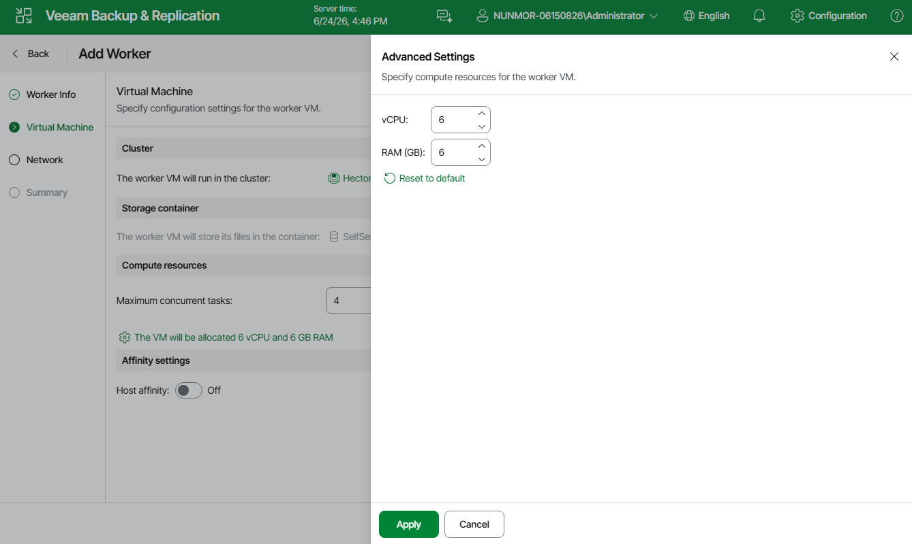

# Step 3. Configure Worker Settings

At the Virtual Machine step of the wizard, do the following:

1. [Applies only to the [Prism Central deployment](ahv_infrastructure_prism_central.md)] Click the link in the Cluster field, and specify in the Choose cluster window a cluster where the worker will reside.

For a cluster to be displayed in the list of the available cluster, it must be configured in the Nutanix AHV Prism Central as described in [Nutanix documentation](https://portal.nutanix.com/page/documents/details?targetId=Prism-Central-Guide-vpc_2023_4:mul-register-wc-t.html).

1. Check the The worker VM will store its files in the container field to see the storage container that is automatically selected for worker system file.

1. In the Maximum concurrent tasks field, specify the number of tasks that the worker will be able to handle in parallel. If this value is exceeded, the worker will not start processing a new task until one of the currently running tasks finishes.

The default number of concurrent tasks is set to 4. When you change this value, the wizard automatically adjusts the amount of resources that will be allocated to the VM running as the worker. If you want to specify the amount of resources manually, click the link below the Maximum concurrent tasks field.

|  |
| --- |
| Note |
| When performing data protection and disaster recovery operations, Veeam Backup & Replication initiates a new task for each VM that is being processed. |

1. To specify a host where the worker will be launched, set the Host affinity toggle to On and click the link in the The worker VM will run on the host field.

If you do not specify host affinity settings, Veeam Backup & Replication will automatically define the host to launch the worker.

Page updated 2026-07-16

