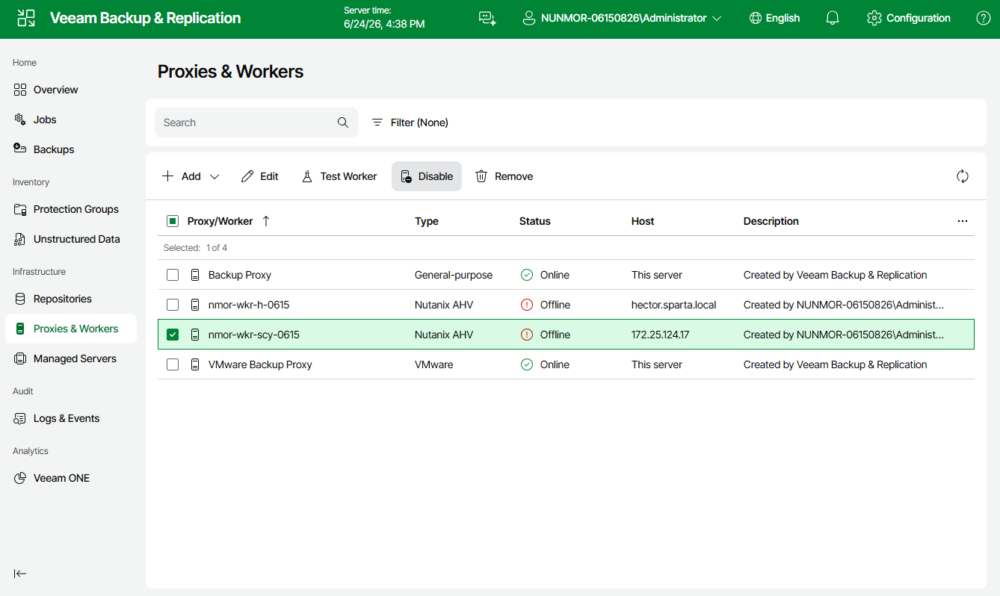

# Enabling and Disabling Workers

By default, workers are launched when jobs or restore sessions start. However, you can temporarily disable a worker — this may be helpful when you reconfigure a worker and you do not want it to be used for a backup or restore operation. You will still be able to test or enable the disabled worker at any time you need.

To enable or disable a worker, do the following:

1. Navigate to Proxies & Workers.
2. Select the necessary worker.
3. Click Enable or Disable.

Page updated 2026-07-15

