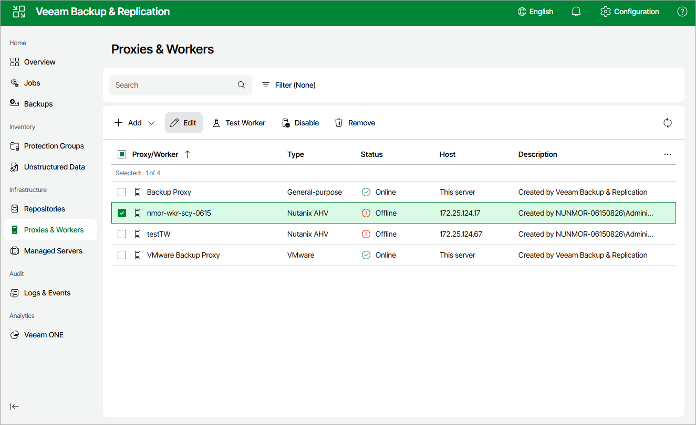

# Editing Workers

For each worker, you can modify settings specified while adding the worker to the backup infrastructure:

1. Navigate to Proxies & Workers.
2. Select the necessary worker and click Edit.
3. Complete the Edit Worker wizard:

1. To provide a new name and description for the worker, follow the instructions provided in section [Adding Workers](ahv_workers_add_name_web.md) (step 2).
2. To change the cluster where worker resides, to specify a host where the worker is launched, or to modify the number of tasks that the worker is able to handle in parallel, follow the instructions provided in section [Adding Workers](ahv_workers_add_vm_web.md) (step 3).
3. To change the network to which the worker is connected or to specify a new IP address for the worker, follow the instructions provided in section [Adding Workers](ahv_workers_add_network_web.md) (step 4).
4. To save changes made to the worker settings, click Finish.

Page updated 2026-07-15

