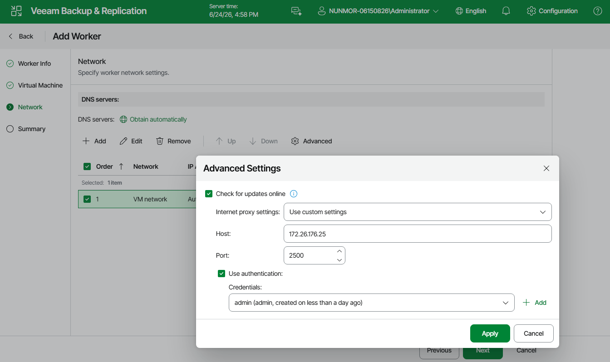

# Disabling Automatic Worker Updates

When launching a worker for a backup or restore operation, Veeam Backup & Replication automatically downloads updates from Veeam repositories and installs them on the worker. If the worker is not connected to the internet, you can instruct Veeam Backup & Replication to [use an internet proxy](ahv_workers_add_network_web.md) that will provide access to the necessary resources.

If a worker does not have access to the internet and no internet proxy is configured for the worker, you can disable automatic updates to avoid connection failures and eliminate session warnings:

1. Open the Edit Worker wizard as described in section [Editing Workers](ahv_workers_edit_web.md).
2. Navigate to the Network step and click Advanced.
3. In the Advanced Settings window, remove selection from the Check for updates online check box and click Apply.

Page updated 2026-07-07

