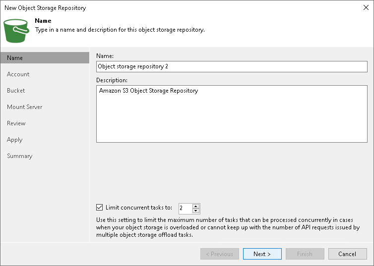

# Step 2. Specify Object Storage Name

At the Name step of the wizard, use the Name and Description fields to enter a name for a new object storage repository and to provide a description for future reference.

If you want to limit the maximum number of tasks that can be processed at once, select the Limit concurrent tasks to N check box.

