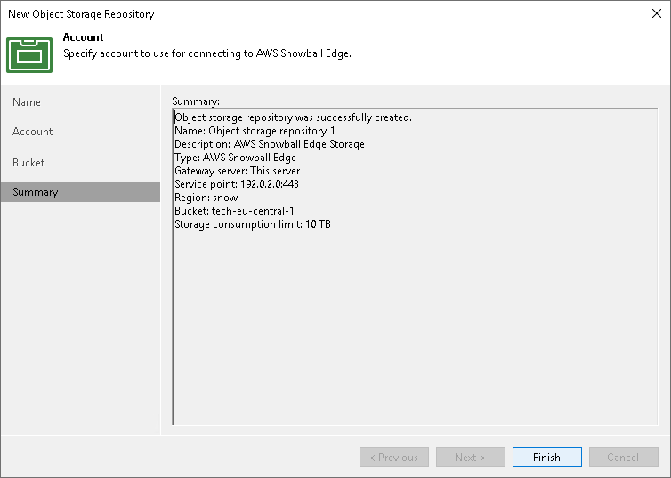

# Step 5. Finish Working with Wizard

In this article

At the Summary step of the wizard, review details of the newly created object storage repository and click Finish.

Page updated 2/28/2024

Page content applies to build 13.0.1.1071
